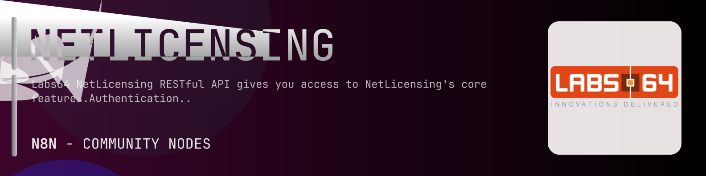

# @n8n-dev/n8n-nodes-netlicensing



[](https://www.npmjs.com/package/@n8n-dev/n8n-nodes-netlicensing)
[](https://opensource.org/licenses/MIT)

---

**Stop writing netlicensing API integrations by hand.**

Every time you connect n8n to netlicensing, you waste hours mapping endpoints, defining parameters, and debugging schemas. You copy-paste from docs, fix edge cases, and pray nothing breaks.

**What if connecting n8n to netlicensing took 5 minutes, not half a day?**

This node gives you **9+ resources** out of the box: **Product**, **Product Module**, **License Template**, **Licensee**, **License**, and 4 more: with full CRUD operations, typed parameters, and zero manual configuration.

---

## What You Get

- **Zero boilerplate**: Resources, operations, and fields are pre-configured and ready to use
- **Full CRUD**: Create, read, update, and delete support where the API allows it
- **Typed parameters**: No more guessing field types
- **Built-in auth**: API key authentication, ready to go
- **Declarative**: Native n8n performance, no custom execute() overhead

---

## Install

```bash
npm install @n8n-dev/n8n-nodes-netlicensing
```

**Or in n8n:**
1. **Settings → Community Nodes → Install**
2. Search: `@n8n-dev/n8n-nodes-netlicensing`
3. Click **Install**

---

## Quick Start

1. Install the node (above)
2. Add credentials: **netlicensing API** → paste your API key
3. Drag the **netlicensing** node into your workflow
4. Pick a resource → pick an operation → done.

That's it. No configuration files. No code. It just works.

---

## Resources

<details>
<summary><b>Product</b> (5 operations)</summary>

- Get List Products
- Post Create Product
- Delete Product
- Get Product
- Post Update Product

</details>

<details>
<summary><b>Product Module</b> (5 operations)</summary>

- Get List Product Modules
- Post Create Product Module
- Delete Product Module
- Get Product Module
- Post Update Product Module

</details>

<details>
<summary><b>License Template</b> (5 operations)</summary>

- Get List License Templates
- Post Create License Template
- Delete License Template
- Get License Template
- Post Update License Template

</details>

<details>
<summary><b>Licensee</b> (7 operations)</summary>

- Get List Licensees
- Post Create Licensee
- Delete Licensee
- Get Licensee
- Post Update Licensee
- Post Transfer Licenses
- Post Validate Licensee

</details>

<details>
<summary><b>License</b> (5 operations)</summary>

- Get List Licenses
- Post Create License
- Delete License
- Get License
- Post Update License

</details>

<details>
<summary><b>Transaction</b> (4 operations)</summary>

- Get List Transactions
- Post Create Transaction
- Get Transaction
- Post Update Transaction

</details>

<details>
<summary><b>Token</b> (4 operations)</summary>

- Get List Tokens
- Post Create token
- Delete token
- Get token

</details>

<details>
<summary><b>Payment Method</b> (3 operations)</summary>

- Get List Payment Methods
- Get Payment Method
- Post Update Payment Method

</details>

<details>
<summary><b>Utility</b> (2 operations)</summary>

- Get List License Types
- Get List Licensing Models

</details>

---

## Why This Node?

**Without this node:**
- Hours of manual API integration
- Copy-pasting from netlicensing docs
- Debugging auth, pagination, error handling
- Maintaining your own client code

**With this node:**
- Install → configure → use. 5 minutes.
- Auto-generated from the official netlicensing OpenAPI spec
- Always up to date when the API changes
- Native n8n performance

---

## Auto-Generated
This node was auto-generated from the official **netlicensing** OpenAPI specification using
[@n8n-dev/n8n-openapi-node-ultimate](https://github.com/kelvinzer0/n8n-openapi-node-ultimate),
then validated against the live API so you get accurate types and real parameters, not guesswork.

When the netlicensing API updates, this node updates too.

---

## Support This Project

If this node saved you hours of work, consider supporting continued development, new APIs, better error handling, and faster updates.

[](https://n8n-code.github.io/membership/#/eyJ0aXRsZSI6IktlZXAgSXQgTW92aW5nIiwiZGVzYyI6Ik9uZSBkZXZlbG9wZXIgYnVpbHQgYSB0b29sIHRoYXQgYXV0by1nZW5lcmF0ZXNcbm44biBub2RlcyBmcm9tIGFueSBPcGVuQVBJIHNwZWMuXG5cbllvdXIgZG9uYXRpb24gZnVuZHMgbmV3IGZlYXR1cmVzLCBtb3JlIEFQSSBzdXBwb3J0LFxuYW5kIGJldHRlciB0b29saW5nIGZvciBldmVyeSBkZXZlbG9wZXIgYWZ0ZXIgeW91LiIsInRhcmdldCI6NTAwMCwiYWRkcmVzc2VzIjp7ImV0aGVyZXVtIjoiMHhmMDU1NWQ0MGRiRkI0ZTNCZjA3MDQ0MjgyQjc4RjJmRTFmNTFFZjcyIiwic29sYW5hIjoiNlpEVk5BYmpZZExEcXo4cGt3VUNHYllaNVV3QlFranB0QzU1Wk5vTFcybVUifSwiZGlzY29yZCI6Imh0dHBzOi8vZGlzY29yZC5nZy9wdERaOGU0aDkzIn0)

---

## License

MIT © [kelvinzer0](https://github.com/n8n-code)
